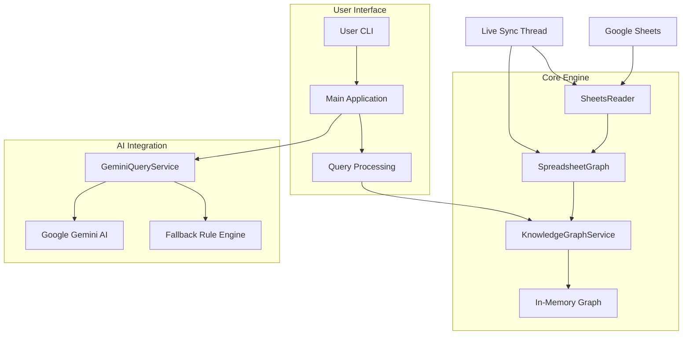
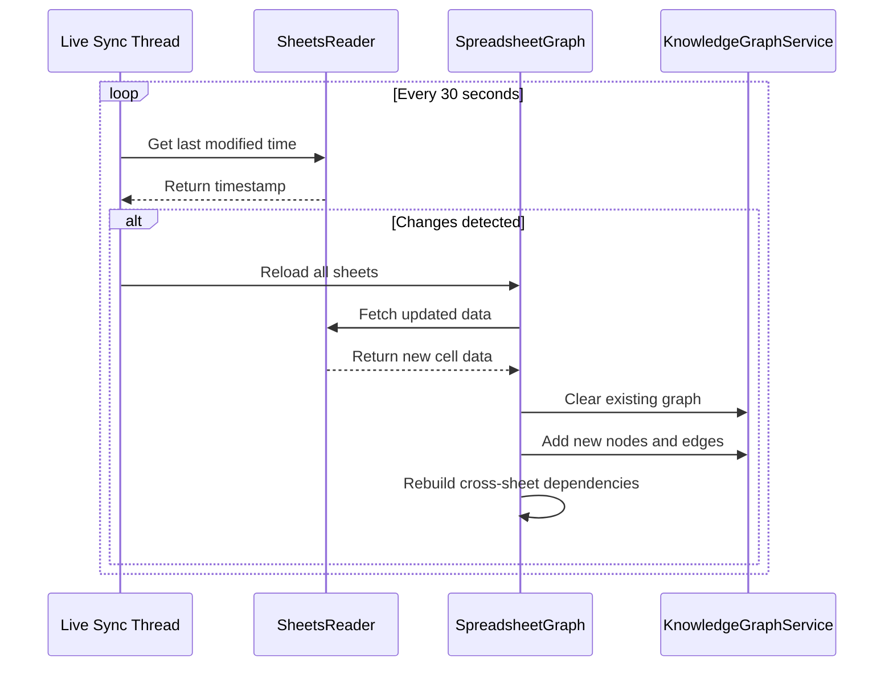

# Spreadsheet Brain - Design Document

## Executive Summary

Spreadsheet Brain is a prototype knowledge graph engine for Google Sheets that transforms spreadsheets into intelligent, queryable data systems. The system builds a real-time knowledge graph that tracks cell dependencies, supports AI-driven natural language queries, and provides comprehensive impact analysis across multiple sheets.

## 1. System Architecture

### High-Level Architecture



### Component Responsibilities

1. **SheetsReader**: Google Sheets API integration, data fetching, and cell updates
2. **SpreadsheetGraph**: Main orchestrator, formula parsing, and cross-sheet dependency building
3. **KnowledgeGraphService**: Graph operations, dependency traversal, and impact analysis
4. **GeminiQueryService**: Natural language query processing with AI and fallback mechanisms
5. **Main**: Application entry point, command processing, and live sync management

### Design Principles

- **Knowledge Graph First**: All spreadsheet data is modeled as a graph with nodes and edges
- **AI-Ready Architecture**: Natural language queries with structured fallback processing
- **Multi-Sheet Support**: Seamless handling of complex spreadsheets with multiple tabs
- **Real-time Capabilities**: Live synchronization with continuous monitoring
- **Extensible Framework**: Easy addition of new query types and analysis features

## 2. Graph Structure (Schema)

### Node Types

#### CellNode
Represents individual cells in the spreadsheet
```java
{
  "id": "SheetName!A1",
  "type": "CELL",
  "sheetId": "SheetName",
  "row": 1,
  "column": 1,
  "value": "Revenue",
  "formula": "=SUM(B1:B10)",
  "a1Notation": "A1"
}
```

#### SheetNode
Represents sheets (tabs) in the spreadsheet
```java
{
  "id": "SheetName",
  "type": "SHEET",
  "name": "Sales Data"
}
```

### Edge Types

#### CONTAINS
Sheet → Cell relationship
- **Source**: SheetNode
- **Target**: CellNode
- **Meaning**: A sheet contains multiple cells

#### DEPENDS_ON
Cell → Cell dependency relationship
- **Source**: Formula cell
- **Target**: Referenced cell
- **Meaning**: Formula cell depends on referenced cell for its value

### Graph Properties

- **Directed Graph**: Dependencies have direction (formula → referenced cell)
- **Cyclic Detection**: Built-in support for detecting circular dependencies
- **Transitive Closure**: Can find all downstream effects of changes
- **Cross-Sheet Edges**: Dependencies can span multiple sheets

## 3. Multi-Sheet Support Implementation

### Cross-Sheet Reference Parsing

The system handles complex cross-sheet references through sophisticated formula parsing:

```java
// Example: =SUMIF(Sales!C:C,A3,Sales!D:D)
// Creates dependencies from current cell to all cells in Sales!C:C and Sales!D:D
```

### Implementation Details

1. **Pattern Matching**: Uses regex patterns to identify cross-sheet references
   ```java
   Pattern CROSS_SHEET_PATTERN = Pattern.compile("([A-Za-z0-9_]+)!([A-Za-z0-9:]+)");
   ```

2. **Column Range Support**: Handles ranges like `A:B`, `C:C`, `D:D`
   - Parses start and end columns
   - Finds all cells within the range
   - Creates dependency edges for each cell

3. **Sheet Loading**: `loadAllSheets()` method loads all sheets simultaneously
   - Maintains sheet hierarchy
   - Preserves cross-sheet relationships
   - Enables unified querying across all sheets

4. **Dependency Building**: Two-phase approach
   - Phase 1: Build same-sheet dependencies
   - Phase 2: Build cross-sheet dependencies

### Example Cross-Sheet Dependencies

```
Sales!E2 (formula: =VLOOKUP(C2,Employees!A:B,2,FALSE))
├── Depends on: Employees!A1, Employees!A2, ..., Employees!B5
└── Creates: 10 dependency edges

Inventory!D2 (formula: =SUMIF(Sales!B:B,A2,Sales!D:D))
├── Depends on: Sales!B1, Sales!B2, ..., Sales!D1, Sales!D2, ...
└── Creates: 12 dependency edges
```

## 4. Update Mechanism

### Live Synchronization

The system maintains real-time synchronization with Google Sheets through:

1. **Background Thread**: Runs every 30 seconds by default
2. **Change Detection**: Compares last modified timestamps
3. **Incremental Updates**: Only reloads when changes are detected
4. **Graph Refresh**: Rebuilds the knowledge graph after changes

### Update Process



### Cell Updates

Users can update cells through:
- **Direct Updates**: `update A1 "New Value"`
- **Natural Language**: `ask Update cell A1 to 100`
- **Programmatic API**: `updateCell()` method

## 5. AI Integration

### Natural Language Query Processing

The system provides intelligent query processing through Google Gemini AI:

1. **Query Translation**: Natural language → Structured commands
2. **Context Awareness**: Understands spreadsheet terminology
3. **Fallback Processing**: Rule-based processing when AI is unavailable
4. **Multi-Modal Support**: Handles various query types

### Query Types Supported

#### Cell Discovery
- `"Show me cells in the Sales sheet"`
- `"Find cells containing formulas"`
- `"List all cells with dates"`

#### Dependency Analysis
- `"What cells depend on A1?"`
- `"Show dependencies of Revenue cell"`

#### Impact Analysis
- `"What will be affected if I change B5?"`
- `"Impact of changing formula in C10"`

#### Cell Updates
- `"Update cell A1 to 100"`
- `"Change the total in F20 to 1500"`

### AI Prompt Engineering

The system uses carefully crafted prompts to ensure accurate query translation:

```json
{
  "system": "You are a spreadsheet analysis assistant. Translate natural language queries into structured commands.",
  "examples": [
    {
      "query": "Show me cells in the Sales sheet",
      "command": {"type": "find_cells", "sheet": "Sales"}
    }
  ]
}
```

## 6. How AI Tools Can Use This Graph

### Query Interface

AI tools can interact with the knowledge graph through:

1. **Structured Queries**: Direct graph traversal operations
2. **Natural Language**: High-level queries in human language
3. **Programmatic API**: Direct method calls for custom logic

### Use Cases for AI Tools

#### 1. Formula Optimization
- Analyze dependency chains to suggest optimizations
- Identify redundant calculations
- Suggest more efficient formula structures

#### 2. Data Validation
- Detect circular dependencies
- Validate formula consistency
- Identify orphaned cells

#### 3. Impact Analysis
- Predict consequences of changes
- Identify critical path cells
- Suggest safe modification strategies

#### 4. Documentation Generation
- Auto-generate dependency diagrams
- Create formula documentation
- Generate change impact reports

### Extensibility Points

The architecture supports easy extension through:

1. **Custom Query Types**: Add new query patterns
2. **Graph Algorithms**: Implement custom traversal logic
3. **AI Models**: Integrate different LLM providers
4. **Visualization**: Add graph visualization capabilities

## 7. Technical Implementation Details

### Technology Stack

- **Language**: Java 17
- **Build Tool**: Maven
- **Graph Storage**: In-memory with custom implementation
- **AI Integration**: Google Gemini API
- **Sheets Integration**: Google Sheets API v4
- **Logging**: SLF4J with Logback

### Performance Characteristics

- **Memory Usage**: Linear with number of cells
- **Query Performance**: O(V + E) for graph traversals
- **Update Performance**: O(n) for n affected cells
- **Scalability**: Tested with 75+ cells across 3 sheets

### Error Handling

- **Graceful Degradation**: Fallback processing when AI is unavailable
- **Robust Parsing**: Handles malformed formulas gracefully
- **API Resilience**: Retry logic for Google API calls
- **User Feedback**: Clear error messages and suggestions

## 8. Future Enhancements

### Planned Features

1. **Graph Visualization**: Interactive dependency diagrams
2. **Advanced Analytics**: Statistical analysis of dependencies
3. **Collaboration Features**: Multi-user impact analysis
4. **Performance Optimization**: Incremental graph updates
5. **Extended Formula Support**: More complex formula patterns

### Scaling Considerations

1. **Database Integration**: Persistent graph storage
2. **Distributed Processing**: Handle larger spreadsheets
3. **Caching Layer**: Improve query performance
4. **API Rate Limiting**: Handle Google API quotas
5. **Memory Optimization**: Efficient graph representation

This design document outlines a comprehensive, AI-ready knowledge graph system that transforms spreadsheets into intelligent, queryable data systems while maintaining real-time synchronization and supporting complex multi-sheet scenarios. 